# FluxQueue Architecture

This document describes the internal architecture of FluxQueue.

FluxQueue is designed to provide **durable messaging with simple operations** using a single-node broker backed by **RocksDB**.

---

## System Architecture

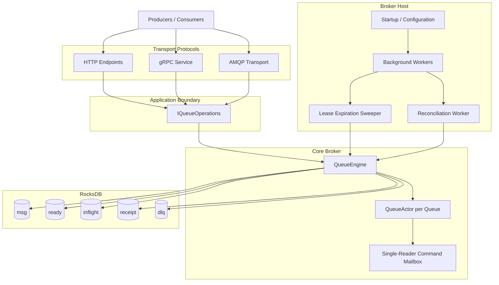

Core components:

- Broker Host
- Transport Protocols (HTTP, gRPC, AMQP)
- Queue Engine
- Persistent Storage (RocksDB)

---

# Architectural Principles

FluxQueue follows several architectural principles:

- Simplicity over operational complexity
- Durable local persistence
- Deterministic message lifecycle
- Isolation of queue coordination
- Actor-style per-queue command serialization
- Log-structured storage for high write throughput

---

# Actor-Style Queue Coordination

FluxQueue uses an **actor-style per-queue coordination model** rather than a pure actor-system runtime.

Each queue can have a dedicated `QueueActor` that processes queue-local commands through a **single-reader mailbox**. This design serializes consumer-facing operations for a queue and reduces race conditions around message state transitions.

## Actor Coordination Model

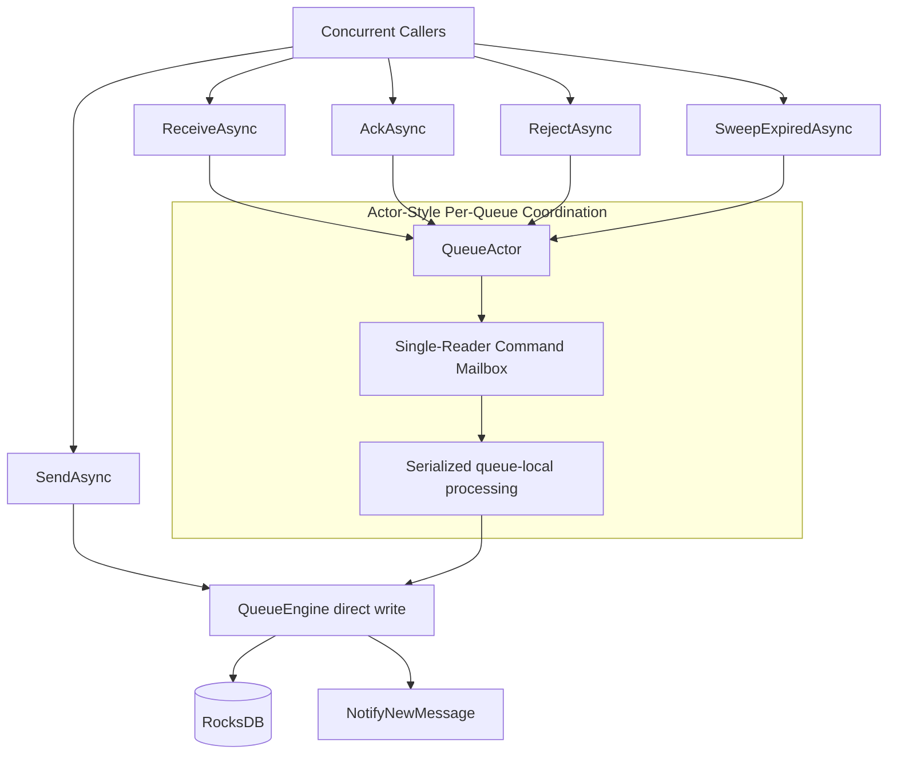

## What the QueueActor Owns

The `QueueActor` is responsible for coordinating queue-local operations such as:

- receive
- ack
- reject
- lease expiration sweeping
- long-poll receive fulfillment

It maintains queue-local coordination state such as:

- pending receive requests
- new-message signaling
- actor lifecycle and idle cleanup
- serialized command processing

## Why This Design Was Chosen

Queue workloads involve concurrent operations from multiple callers:

- consumers receiving messages
- consumers acknowledging messages
- consumers rejecting messages
- background sweeps reclaiming expired leases

Without a serialization boundary, these operations could interleave in ways that make state transitions difficult to reason about.

The actor-style design provides:

- a **single logical coordinator per queue**
- **serialized processing** of queue-local commands
- a simpler mental model for consumer-side state transitions
- reduced lock contention compared to coarse global locking

## Important Precision

FluxQueue should **not** be described as a pure Actor Model implementation in the strict Erlang/Akka sense.

Not all queue mutations currently flow through `QueueActor` instances.

For example:

- producer writes in `SendAsync(...)` are performed directly by `QueueEngine`
- reconciliation also writes directly to RocksDB
- sequence generation is maintained in shared concurrent structures

Because of this, the most accurate description is:

> FluxQueue uses an **actor-inspired concurrency boundary** for per-queue coordination, especially for consumer-side operations, while still relying on shared RocksDB-backed storage and direct engine writes for some system-level operations.

## Benefits

This approach still provides meaningful advantages:

- predictable per-queue concurrency
- clearer ownership of consumer-side coordination
- deterministic handling of receive/ack/reject flows
- practical actor-style behavior without introducing a full actor framework

---

# RocksDB Architectural Principles

FluxQueue uses **RocksDB** as its storage engine. The choice of RocksDB is based on several architectural principles that align well with message broker workloads.

## RocksDB Write Path

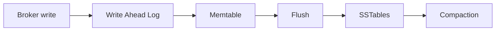

## Log-Structured Merge Tree (LSM)

RocksDB is built on the **LSM-tree architecture**, which optimizes for:

- high write throughput
- mostly sequential disk operations
- efficient write-heavy workloads

Message brokers are typically append-heavy systems, so this storage model fits well.

## Write Optimization

Instead of updating data in-place, RocksDB typically:

1. appends writes to a **Write Ahead Log (WAL)**
2. buffers writes in an in-memory **memtable**
3. flushes data into immutable **sorted SSTables**

This supports FluxQueue's goals of:

- durable writes
- low random-write overhead
- efficient batched updates

## Compaction

RocksDB periodically performs **compaction** to merge SSTables and remove obsolete data.

This is important for queue workloads because message lifecycle transitions naturally create stale versions and obsolete index entries over time.

Compaction helps:

- reclaim disk space
- maintain read performance
- keep storage healthy over long-running workloads

## Column Families

FluxQueue uses **column families** to separate message storage from queue indexes.

| Column Family | Purpose |
|---------------|--------|
| `msg` | Message payload storage |
| `ready` | Ready queue index |
| `inflight` | Leased message index |
| `receipt` | Receipt token mapping |
| `dlq` | Dead letter queue |

This separation supports:

- logical isolation of broker data structures
- targeted scans by queue state
- clearer mapping between broker lifecycle states and storage layout

## Column Family Rationale

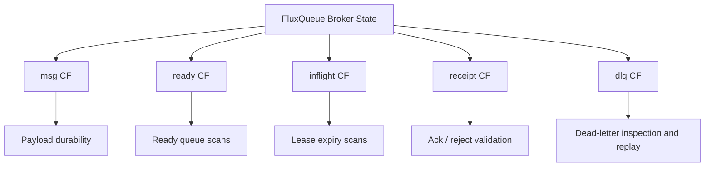

## Embedded Storage

RocksDB is an **embedded database**, which means:

- no external database service is required
- operational overhead stays low
- the broker can access storage directly in-process

That matches FluxQueue's architectural goal of **minimal infrastructure complexity**.

---

# Queue Engine

The `QueueEngine` is the core component responsible for:

- message persistence
- queue indexing
- message leasing
- receipt validation
- dead letter routing
- crash recovery

---

# Message Lifecycle

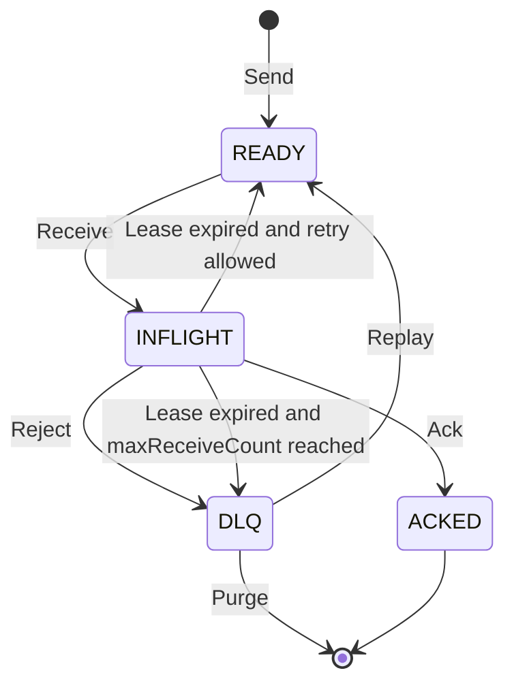

States:

| State | Description |
|------|-------------|
| `READY` | Message available for delivery |
| `INFLIGHT` | Message leased by consumer |
| `ACKED` | Successfully processed and removed |
| `DLQ` | Dead letter queue |

---

# Storage Layout

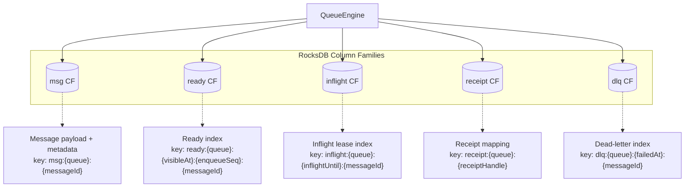

## Storage Transitions

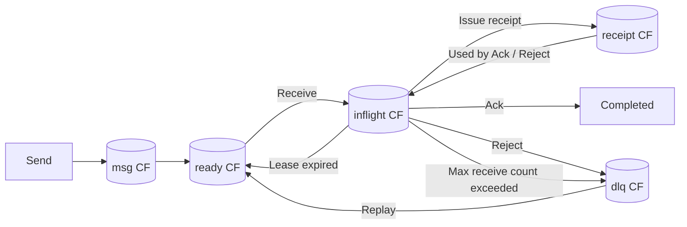

---

# Long-Poll Receive Flow

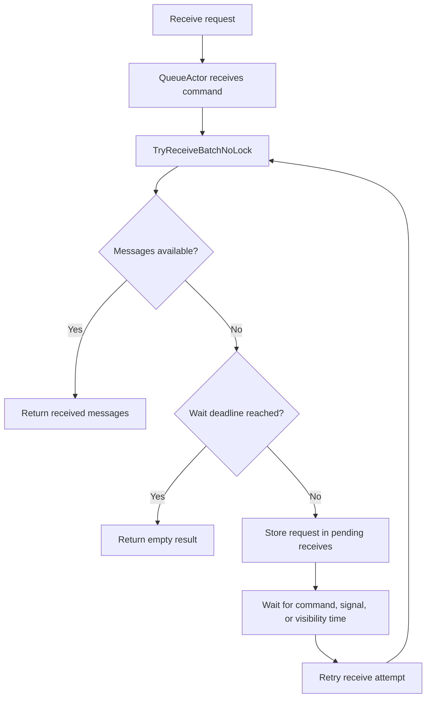

---

# Acknowledge and Reject Flow

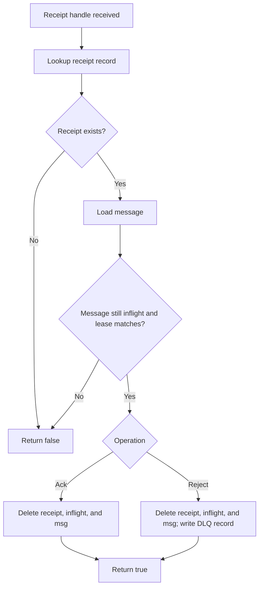

---

# Lease Expiration

When a consumer receives a message:

1. Message moves from `READY` → `INFLIGHT`
2. A lease expiration timestamp is assigned
3. The consumer receives a receipt token

If the consumer does not acknowledge before the lease expires, the sweeper reclaims the message.

## Sweeper Flow

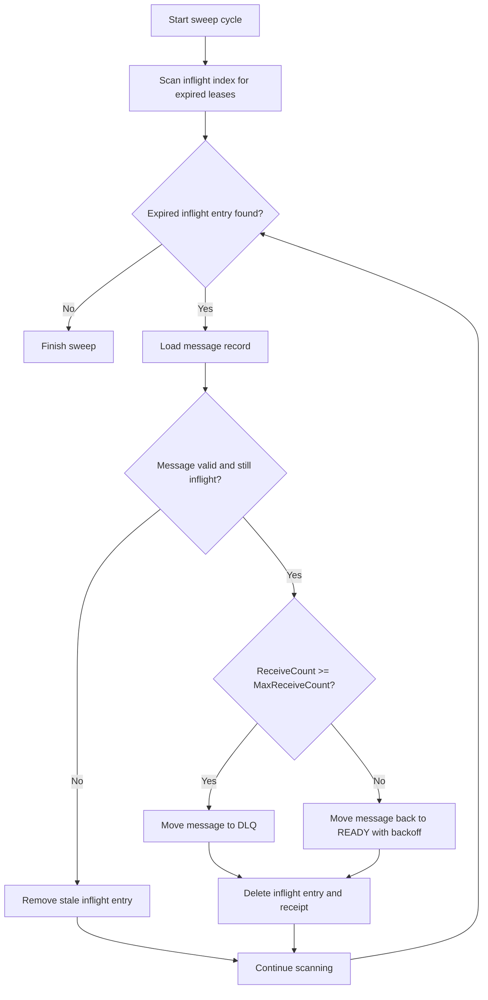

## Lease Timeout Recovery Sequence

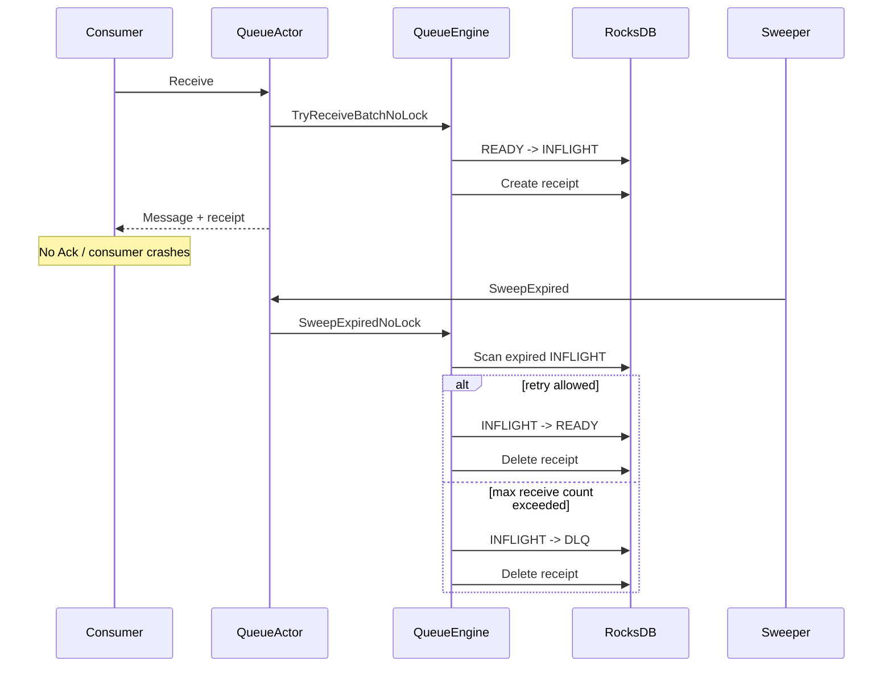

---

# Reconciliation

The reconciliation engine rebuilds indexes from the durable message store.

This ensures recovery after:

- broker crashes
- partial writes
- index corruption

## Reconciliation Flow

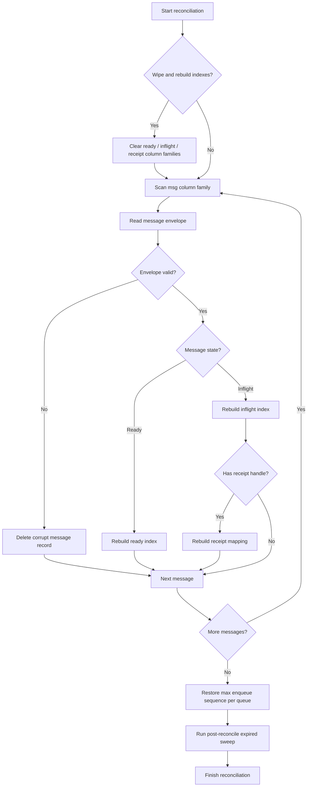

---

# Reliability Guarantees

FluxQueue provides:

### At-Least-Once Delivery

Messages may be delivered more than once but will not be lost.

### Crash Recovery

State can be reconstructed from durable storage.

### Message Durability

Messages are persisted before acknowledgement.

---

# Future Architecture Directions

### Observability

- Prometheus metrics
- OpenTelemetry tracing

### Security

- authentication
- authorization
- TLS transport security

### Distributed Mode

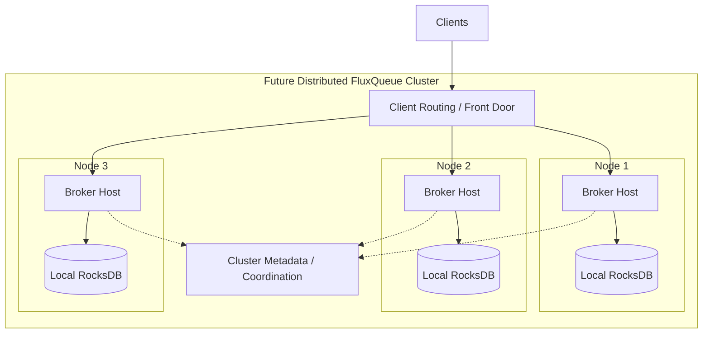

---

# Summary

FluxQueue prioritizes:

- simplicity
- durability
- predictable performance

By combining **RocksDB log-structured storage**, **actor-style per-queue coordination**, and **lease-based delivery**, FluxQueue provides a reliable messaging system without requiring complex cluster infrastructure.
