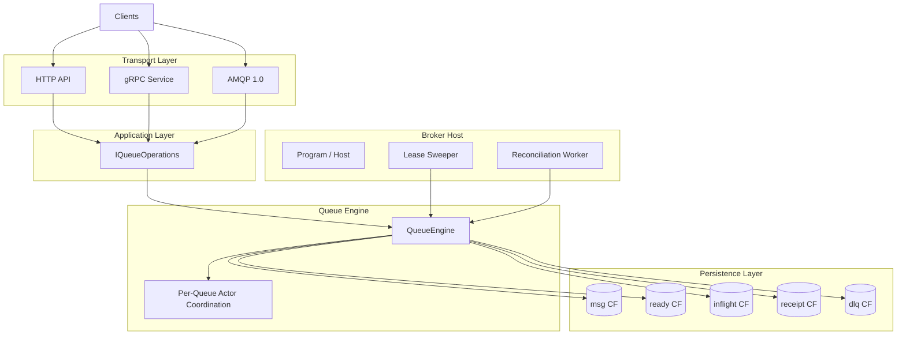
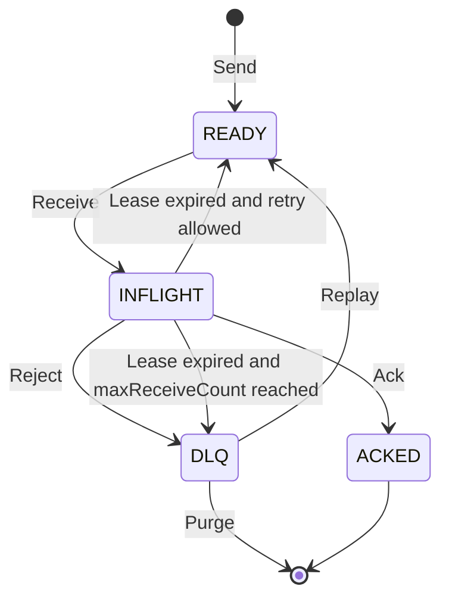
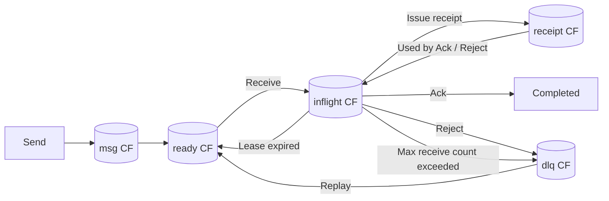

# FluxQueue


FluxQueue is a lightweight message broker built with **.NET** and **RocksDB**.

It provides **durable messaging with minimal operational complexity**, making it suitable for:

- local infrastructure
- edge deployments
- internal services
- lightweight distributed systems

FluxQueue supports multiple transport protocols:

- HTTP
- gRPC
- AMQP 1.0

The goal of FluxQueue is to deliver **reliable messaging with simple operations** without requiring complex cluster infrastructure.

---

## Features

### Durable Messaging

Messages are persisted using **RocksDB**, providing fast embedded storage with crash-safe durability.

### Multiple Protocols

FluxQueue supports:

- HTTP API
- gRPC
- AMQP 1.0

All protocols share the same internal queue engine.

### Telemetry

FluxQueue can emit OpenTelemetry traces and metrics for HTTP, gRPC, AMQP, and the shared queue operations layer.

### Lease-Based Message Processing

FluxQueue uses **message leases** to prevent message loss.

Messages move through explicit lifecycle states:

```text
READY → INFLIGHT → ACKED / DLQ
```

If a consumer crashes or fails to acknowledge a message, the lease expires and the message can be reclaimed and either re-queued or moved to the dead letter queue depending on retry policy.

### Dead Letter Queue

Messages that repeatedly fail processing can be moved to a **dead letter queue (DLQ)**.

### Crash Recovery

FluxQueue includes recovery mechanisms:

- lease expiration sweeper
- reconciliation engine that rebuilds indexes

---

## Architecture Overview



For deeper design details, see [ARCHITECTURE.md](ARCHITECTURE.md).

---

## Message Lifecycle



---

## Storage Model

FluxQueue stores data using **RocksDB column families**.

| Column Family | Purpose |
|---------------|---------|
| `msg` | message payload storage |
| `ready` | ready queue index |
| `inflight` | leased message index |
| `receipt` | receipt token mapping |
| `dlq` | dead letter queue |



---

## Running FluxQueue

### Using Docker

```bash
docker compose up
```

Default ports:

| Protocol | Port |
|----------|------|
| HTTP | 8080 |
| gRPC | 5001 |
| AMQP | 5672 |

To enable OpenTelemetry export, configure the broker host:

```json
"OpenTelemetry": {
  "ServiceName": "FluxQueue.BrokerHost",
  "Otlp": {
    "Enabled": true,
    "Endpoint": "http://otel-collector:4317"
  }
}
```

---

## Usage Examples

### HTTP Example

Send a message:

```http
POST /queues/{queue}/messages
Content-Type: application/json

{
  "payloadBase64": "SGVsbG8="
}
```

Receive a message:

```http
POST /queues/{queue}/receive
```

Acknowledge:

```http
POST /queues/{queue}/ack
```

Reject:

```http
POST /queues/{queue}/reject
```

---

### gRPC Example

Example .NET client:

```csharp
using Google.Protobuf;
using Grpc.Net.Client;

var channel = GrpcChannel.ForAddress("http://localhost:5001");
var client = new QueueService.QueueServiceClient(channel);

var sendResponse = await client.SendAsync(new SendRequest
{
    Queue = "orders",
    Payload = ByteString.CopyFromUtf8("hello world")
});

var receiveResponse = await client.ReceiveAsync(new ReceiveRequest
{
    Queue = "orders"
});

await client.AckAsync(new AckRequest
{
    Queue = "orders",
    Receipt = receiveResponse.Receipt
});
```

---

### AMQP Example

Example using a generic Python AMQP 1.0 client:

```python
from proton import Message
from proton.handlers import MessagingHandler
from proton.reactor import Container

class Sender(MessagingHandler):
    def on_start(self, event):
        conn = event.container.connect("amqp://localhost:5672")
        sender = event.container.create_sender(conn, "orders")
        sender.send(Message(body="hello world"))

Container(Sender()).run()
```

AMQP addresses map directly to FluxQueue queues.

---

## Project Structure

```text
FluxQueue
│
├── FluxQueue.BrokerHost
│   Broker host and protocol servers
│
├── FluxQueue.Core
│   Core queue engine and storage logic
│
├── FluxQueue.Transport.Abstractions
│   Transport interfaces
│
├── FluxQueue.Transport.Amqp
│   AMQP implementation
│
├── integration-tests
│   End-to-end protocol tests
│
└── unit-tests
    Queue engine unit tests
```

---

## Development

Build the project:

```bash
dotnet build
```

Run the broker:

```bash
dotnet run --project FluxQueue.BrokerHost
```

Run the broker with the Aspire dashboard:

```bash
dotnet run --project FluxQueue.AppHost
```

---

## Status

FluxQueue is currently **in active development (alpha)**.

Implemented capabilities:

- durable message storage
- HTTP API
- gRPC support
- AMQP protocol support
- message leasing
- dead letter queues
- reconciliation and crash recovery

---

## Roadmap

### Observability

- queue metrics
- telemetry dashboards and exporters
- queue inspection APIs

### Reliability

- crash recovery tests
- reconciliation stress testing
- AMQP edge-case validation

### Security

- HTTP authentication
- queue authorization

### Production Readiness

- performance optimizations
- operational tooling
- stability improvements

### Future Distributed Mode

Potential future directions include:

- leader-per-queue ownership
- partitioned queues with consistent hashing
- replicated write-ahead log
- cluster metadata and shard routing

---

## Contributing

Contributions are welcome.

Development work is tracked using:

- GitHub Issues
- Milestones
- Project board

---

## License

MIT License
